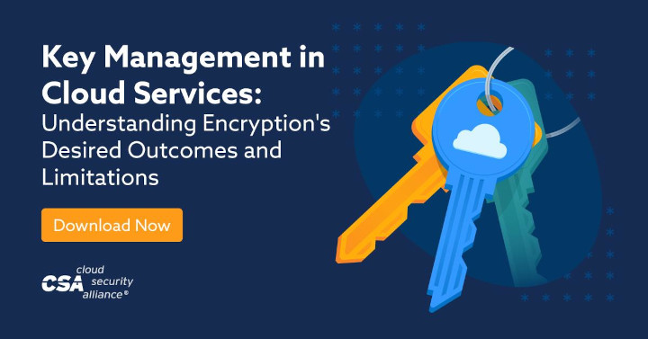
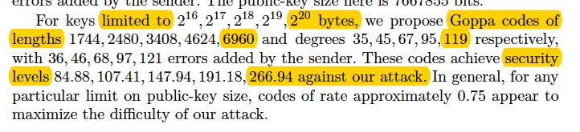
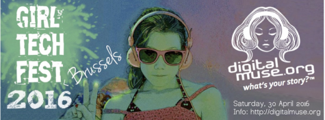
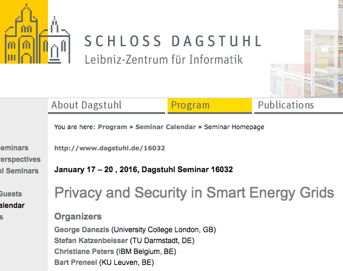
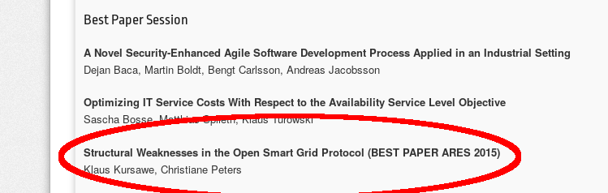
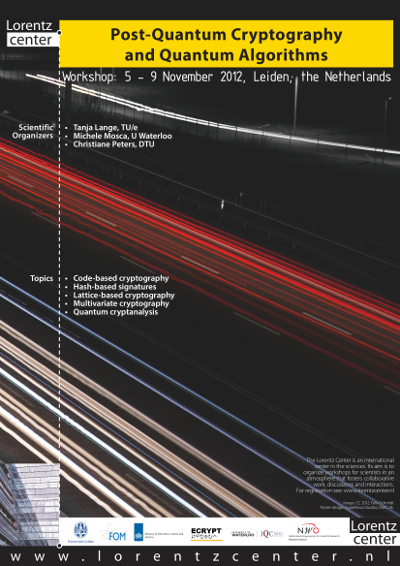
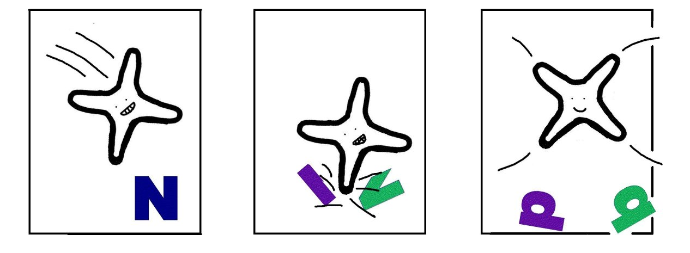

## Post-Quantum Cryptography at Google
**date: 2022.07.11**

I got a friendly acknowledgement in a Google Blog post for my contribution to the NIST competition as part of the [Classic McEliece](https://classic.mceliece.org/) team.

[How Google is preparing for a post-quantum world](https://cloud.google.com/blog/products/identity-security/how-google-is-preparing-for-a-post-quantum-world)


<br/><br/>
## Conferences
**date: 2021.08.15**

I actively contributed to the organization and / or program committees [PCs] of the following events:

- [Selected Areas in Cryptography (SAC) 2021](https://www.sac2021.ca/) ‒ Virtual Conference ‒ Sep 29 - Oct 1, 2021 \[PC member\].
- [Latincrypt 2021](https://www.urosario.edu.co/Latin-Crypt-2020/inicio/) ‒ Virtual Conference ‒ October 6-8, 2021 \[PC member\].
- [Selected Areas in Cryptography (SAC) 2020](https://sac2020.ca/cfp.html) ‒ Virtual Conference ‒ Oct 19-23, 2020 \[PC member\].
- [WEWoRC 2015](http://2015.weworc.org/ "WEWoRC 2015") ‒ Cottbus, Germany, October 2015 \[PC member\]. (Update: workshop canceled)
- [Indocrypt 2014](http://cse.iitkgp.ac.in/conf/INDOCRYPT2014/) ‒ New Delhi, India, December 2014 \[PC member\].
- [Selected Areas in Cryptography (SAC) 2014](http://users.encs.concordia.ca/~youssef/SAC2014-WebSite/index.php) ‒ Montreal, QC, Canada, August 2014 \[PC member\].
- [MoCrySEn 2013](http://mocrysen2013.inria.fr/) ‒ Regensburg, Germany, September 2013 \[PC member\].
- [Selected Areas in Cryptography (SAC) 2013](http://sac2013.irmacs.sfu.ca/) ‒ Vancouver, BC, Canada, August 2013 \[PC member\].
- [CrossFyre 2013](http://www.cosic.esat.kuleuven.be/crossfyre/) ‒ Leuven, Belgium, June 2013 \[Co-organizer\].
- [Code-based Cryptography Workshop 2013](http://cbc2013.inria.fr/) ‒ Paris-Rocquencourt, France, June 2013 \[PC member\].
- [YACC 2012](http://yacc.univ-tln.fr/) ‒ Porquerolles Island, France, September 2012 \[PC member\].
- [CrossFyre 2012](http://www.crossfyre.cased.de/home.html) ‒ Eindhoven, the Netherlands, June 2012 \[Co-organizer\].
- [Code-based Cryptography Workshop](http://cbc2012.mat.dtu.dk/) ‒ Kgs. Lyngby, Denmark, May 2012 \[Organizer\].
- [PKC 2012](http://pkc2012.cased.de/) ‒ Darmstadt, Germany, May 2012 \[PC member\].
- [PQCrypto 2011](http://pq.crypto.tw/pqc11/) ‒ Taipei, Taiwan, December 2011 \[PC member\].
- [ECRYPT-II Code-based Cryptography Workshop](http://www.win.tue.nl/cccc/cbc/) ‒ Eindhoven, the Netherlands, May 2011 \[Co-organizer\].
- [CrossFyre 2011](http://www.crossfyre.cased.de/home.html) ‒ Darmstadt, Germany, April 2011 \[Co-organizer\].


<br/><br/>
## Cloud Security Alliance - Key Management in Cloud Services
**date: 2020.11.10**

I actively contributed to the architecture patterns in the **[Key Management in Cloud Services](https://cloudsecurityalliance.org/artifacts/key-management-when-using-cloud-services/)** Guidance document published by the [Cloud Security Alliance Key Management Working group](https://cloudsecurityalliance.org/research/working-groups/cloud-key-management/).

[](https://cloudsecurityalliance.org/artifacts/key-management-when-using-cloud-services)


<br/><br/>
## Classic McEliece - NIST PQC Round 3 Finalist
**date: 2020.07.23**

NIST [announced](https://groups.google.com/a/list.nist.gov/forum/?utm_medium=email&utm_source=footer#!msg/pqc-forum/0ieuPB-b8eg/Cl7Ji8TpCwAJ) yesterday that [Classic McEliece](https://classic.mceliece.org/index.html) is one of the [Round-3 Finalists](https://csrc.nist.gov/projects/post-quantum-cryptography/round-3-submissions) in the Post-Quantum Cryptography Standardization Process.

_"As such, NIST selected Classic McEliece as a finalist and believes it could be ready for standardization (should NIST choose to select it) at the end of the third round."_

The full report by NIST can be found [here](https://nvlpubs.nist.gov/nistpubs/ir/2020/NIST.IR.8309.pdf).

The **Classic McEliece** submission in Round 3 is a merger of the _Classic McEliece_ and _NTS-KEM_ submissions to the previous rounds. The submission builds on code-based cryptography with binary Goppa codes, a proposal that has not been broken for more than 40 years.


<br/><br/>
## Blog post on Cryptography Services for Enterprises
**date: 2019.10.21**


I wrote a blog post on "**How to Make Cryptography Services Work for Your Organization**" which was published on the [IBM Security Intelligence website](https://securityintelligence.com/posts/how-to-make-cryptography-services-work-for-your-organization/). Check it out for some real-world lessons learned.


<br/><br/>
## Architect Certification
**date: 2019.10.16**

I completed the Level 2 certification as **IBM and Open Group Architect** in October 2019. This certification is not a one-time sit-down learn-stuff-by-heart and forget-all-again. Instead, I earned the certification by working continuously as architect for multiple years and by demonstrating my achievements to an internal review board at IBM.

I have led several large projects as security architect. My reference projects concerned architectures for smart metering security, cryptography services for financial services, and enterprise security architectures. I followed a series of trainings on architecture, design thinking, consulting and project management. I also specialized not only in security architecture, but also learned how IT is managed for a specific industry: in my case I focused on banks. Further I earned this certification by giving presentations at international conferences and summer schools, by creating reusable assets, and last but not least by mentoring others.


<br/><br/>
## NIST PQCrypto Classic McEliece submission
**date: 2018.04.07**

[Classic McEliece](https://classic.mceliece.org) Submission to [NIST](https://csrc.nist.gov/Projects/Post-Quantum-Cryptography)'s [Post-Quantum Standardization](https://csrc.nist.gov/Projects/Post-Quantum-Cryptography/Round-1-Submissions) together with [Daniel J. Bernstein](https://cr.yp.to/djb.html), [Tung Chou](https://tungchou.github.io/), [Tanja Lange](https://hyperelliptic.org/tanja), Ingo von Maurich, Rafael Misoczki, [Ruben Niederhagen](http://polycephaly.org/), [Edoardo Persichetti](http://persichetti.webs.com/), [Peter Schwabe](https://cryptojedi.org/), Nicolas Sendrier, [Jakub Szefer](http://caslab.csl.yale.edu/~jakub), and [Wen Wang](http://caslab.csl.yale.edu/~wen).

Great to see that my Ph.D. research is relevant for the next crypto standardization, i.e., the parameters in the 2008 paper **Attacking and defending the McEliece cryptosystem** are still holding up.



Now included as the IND-CCA2 KEM parameters for mceliece6960119:

```
m = 13, n = 6960, t = 119, l = 256.
```

Moreover, more PQCrypto code-based crypto submissions also used my [complexity computations](scripts.html) to determine the security level of their proposals.


<br/><br/>
## Enterprise Key and Certificate Management
**date: 2018.01.09**

I gave a lecture at the ECRYPT winter school in Zurich, Switzerland on how large enterprises manage cryptographic keys and public-key certificates.

[ECRYPT-CSA School on Societal Aspects of Cryptology and on Business and Innovation in Crypto](https://www.cosic.esat.kuleuven.be/events/ecrypt-csa-school-cryptology/ "ECRYPT-CSA School on Societal Aspects of Cryptology and on Business and Innovation in Crypto"), 7-9 January 2018,Zurich, Switzerland.

One of the goals was to bridge the gap between industry and academia. I.e., answering the question: how long will it take to get pqcrypto research into practice in a large enterprise environment.


<br/><br/>
## Blog post: GDPR Readiness
**date: 2017.03.24**

I published an IBM Blog post: [What to expect from the GDPR readiness assessment](https://www.ibm.com/blogs/think/be-en/2017/03/24/expect-gdpr-readiness-assessment/).


<br/><br/>
## Crypto Workshop Girl Tech Fest Brussels
**date: 2016.05.04**

Together with my IBM Belgium colleagues I organized a crypto workshop for 10-14 year old girls at the [Digital Muse Girl Tech Fest](http://digitalmuse.org/girl-tech-fest-brussels-2016/) in Brussels on Saturday April 30, 2016. We ran 4 workshops where the girls learned how to make and break ciphers - all toy examples of course. Still, lots of fun and great to see that girls enjoy math and crypto!




<br/><br/>
## Dagstuhl Seminar 16032
**date: 2016.01.16**

[](http://www.dagstuhl.de/16032)

[**Privacy and Security in Smart Energy Grids**](http://www.dagstuhl.de/16032) January 17‒20, 2016 Dagstuhl, Germany Scientific organization together with [George Danezis](http://www0.cs.ucl.ac.uk/staff/G.Danezis/), [Stefan Katzenbeisser](http://www.seceng.informatik.tu-darmstadt.de/people/katzenbeisser/), and [Bart Preneel](http://homes.esat.kuleuven.be/~preneel/)


<br/><br/>
## Best Paper ARES 2015
**date: 2015.08.26**

Klaus Kursawe and I won the ARES 2015 Best Paper Award for our paper **Structural Weaknesses in the Open Smart Grid Protocol**. [eprint](http://eprint.iacr.org/2015/088)




<br/><br/>
## FP7 project SEGRID
**date: 2015.04.30**

While working for [ENCS](https://encs.eu/) I was one of the researchers on the FP7 project SeGRID (Security for Smart Electricity GRIDs ). I contributed in particular to the deliverables.

D1.1 – Architecture and design for use cases. [html](https://segrid.eu/d1-1-architecture-and-design-for-use-cases/)

D1.3 – First report on Security & privacy goals. [html](https://segrid.eu/d1-3-first-report-on-security-privacy-goals/)

Project website: [https://segrid.eu/](https://segrid.eu/)


<br/><br/>
## Austria Smart Meter Security Requirements"
**date: 2015.03.30**

At [ENCS](https://encs.eu/) I co-wrote the Smart Meter Requirements for Austria's End-to-End Secure Smart Metering architecture published by [Oesterreichs Energie](https://oesterreichsenergie.at/). We wrote the original in German, then added an English translation later. The documents were made available to the public: [https://oesterreichsenergie.at/sicherheitsanforderungen-fuer-smart-meter.html](https://oesterreichsenergie.at/sicherheitsanforderungen-fuer-smart-meter.html)


<br/><br/>
## Visiting MSR
**date: 2013.02.05**

I am visiting the [Cryptography Research Group](http://research.microsoft.com/en-us/groups/crypto/) at Microsoft Research in Redmond from February 4 to April 26, 2013. Thanks to Kristin Lauter and Michael Naehrig for inviting me.


<br/><br/>
## Decoding Wild Goppa Codes
**date: 2012-10.12**

A simple Python script to decode wild Goppa codes. The algorithm is described in detail in the article [Wild McEliece](http://eprint.iacr.org/2010/410).

See here: [https://github.com/christianepeters/wild](https://github.com/christianepeters/wild)


<br/><br/>
## Postdoc at UIC
**date: 2012.10.12**

Thanks to Dan Bernstein and NIST for employing me for the period of three months as research associate in the Computer Science Department at the [University of Illinois at Chicago](http://www.cs.uic.edu/).

Also a big thanks to [Jon Solworth](http://www.ethos-os.org/~solworth/) for giving me asylum in the RITES lab.


<br/><br/>
## Lorentz Center Workshop
**date: 2012.10.12**

[](http://lorentzcenter.nl/lc/web/2012/519/info.php3?wsid=519)

[**Post-Quantum Cryptography and Quantum Algorithms**](http://lorentzcenter.nl/lc/web/2012/519/info.php3?wsid=519) November 5‒9, 2012 Leiden, the Netherlands Scientific organizers: [Tanja Lange](http://hyperelliptic.org/tanja/index.html), [Michele Mosca](http://www.iqc.ca/~mmosca/), and Christiane Peters

Wiki page containing the program, contributed talks, working groups:[](https://wiki.pqcrypto.org/mediawiki/index.php/Main_Page)

[https://wiki.pqcrypto.org/mediawiki/index.php/Main\_Page](https://wiki.pqcrypto.org/mediawiki/index.php/Main_Page)


<br/><br/>
## Code-based Cryptography Workshop May 2012
**date: 2012.10.12**

I organized the **Code-based Cryptography Workshop in 2012**: May 9-11 at the Technical University of Denmark.

[http://2012.cbc.pqcrypto.org/](http://2012.cbc.pqcrypto.org/)


<br/><br/>
## FTP grant
**Fall 2011**

On September 1, 2011 I started as a postdoc in the Math department at the Technical University of Denmark. The position is funded by a Technology and Production Sciences (FTP) grant by the [Danish Council for Independent Research](http://en.fi.dk/councils-commissions/the-danish-council-for-independent-research/scientific-research-councils/technology-production-science) under grant number 11-105325; awarded 1,622,015 DKK for the purpose of conducting research on “Code-based Cryptography”.

- [official announcement](http://www.fi.dk/tilskud/bevillingsoversigter/2011/bevillinger-fra-det-frie-forskningsraad-2502-teknologi-og-produktion-maj-2011/)
- [project description "Code-based Cryptography"](cbcrypto.html)


<br/><br/>
## Rubicon Award
**Summer 2011**

Rubicon Award 2011 by the [Netherlands Organization for](http://www.nwo.nl/) [Scientific Research (NWO)](http://www.nwo.nl/); awarded 163,763 Euro for the purpose of conducting research on “Code-based Cryptography”; grant money declined because in conflict with [FTP grant](#ftp-grant).

Official announcements in [English](http://www.nwo.nl/nwohome.nsf/pages/NWOP_8JFHCD_Eng) and [Nederlands](http://www.nwo.nl/nwohome.nsf/pages/NWOP_8JFHCD).


<br/><br/>
## Code-based Cryptography Workshop May 2011
**May 2011**

Together with Tanja Lange I co-organized the **Code-based Cryptography Workshop**: May 11-12, 2011 at Technische Universiteit Eindhoven, The Netherlands.

[http://www.win.tue.nl/cccc/cbc/](http://www.win.tue.nl/cccc/cbc/)


<br/><br/>
## Dissertation
**May 2011**

In May 2011, I completed my Ph.D. studies at the [Technische Universiteit Eindhoven](http://w3.tue.nl/en/) in the Coding and Cryptology Group under the supervision of [Tanja Lange](http://hyperelliptic.org/tanja/index.html) and [Daniel J. Bernstein](http://cr.yp.to/djb.html).

- Ph.D. thesis: **Curves, Codes, and Cryptography.** Technische Universiteit Eindhoven. The Netherlands, 2011.   [pdf](https://github.com/christianepeters/phdthesis/blob/master/20110510.diss.pdf) [bibtex](https://github.com/christianepeters/bibtex/blob/master/cpeters-diss.bib) [statements](https://github.com/christianepeters/phdthesis/blob/master/stellingen.pdf)


<br/><br/>
## Iteration count for ISDFq attack
**Summer 2010**

My paper [Information-set decoding for linear codes over Fq](http://eprint.iacr.org/2009/589) presents a new algorithm for decoding linear codes over arbitrary finite fields Fq.

The repository [https://github.com/christianepeters/isdfq](https://github.com/christianepeters/isdfq)
contains a PARI/GP file for a crude operation count as well as a precise iteration count on the basis of a Markov-chain computation. The implementation is written in C and uses the MPFI library. Details on how to use the implementation can be found [here](scripts.html).


<br/><br/>
## Iteration count for attack on the original McEliece parameters
**Summer 2009**

Iteration count of the [improved variant of Stern's algorithm for binary linear codes](http://eprint.iacr.org/2008/318) by [Daniel J.  Bernstein](http://cr.yp.to/djb.html), [Tanja Lange](http://www.hyperelliptic.org/tanja/), and myself published at PQCrypto 2008.

Compute the iteration counts for our attack on the McEliece cryptosystem using the type-3 Markov-chain analysis.

[https://github.com/christianepeters/isdf2](https://github.com/christianepeters/isdf2)

The implementation is written in C and uses the MPFI library. Note that you might need to increase the level of precision if you consider codes of length greater than 1024. Change the line
```
int prec = 150;
```
to something more convenient.


<br/><br/>
## Google Anita Borg Scholarship
**June 2009**

Awarded to twenty-one selected female Ph.D. and Master students from Europe for excellence performance in computing and technology; I got 5,000 Euro. :-)

[http://googleblog.blogspot.com/2009/05/announcing-2009-anita-borg-scholars-and.html](http://googleblog.blogspot.com/2009/05/announcing-2009-anita-borg-scholars-and.html)

In June 2009 I went together with the other award winners to the Google Europe Anita Borg Scholarship Retreat in Zürich, Switzerland.


<br/><br/>
## SHA-2 will soon retire
**Summer 2009**

**A brief look at the 56 SHA-3 submissions.** Joint "talk"
by [Michael Naehrig](http://www.cryptojedi.org/users/michael/), [Peter Schwabe](http://www.cryptojedi.org/users/peter/), and myself during the [rump session](http://eurocrypt2009rump.cr.yp.to/) of [Eurocrypt 2009](http://www.iacr.org/conferences/eurocrypt2009/). Cologne, Germany.   [slides](https://github.com/christianepeters/talks/blob/master/20090428.eurocrypt.rump.pdf)   [lyrics and chords](http://cryptojedi.org/music/sha2-retire.shtml) [youtube](http://www.youtube.com/watch?v=4WtF_O7XLMQ)


<br/><br/>
## EECM comic
**Spring 2008**

[](images/eecm-comic-small.jpg)

[EECM](http://eecm.cr.yp.to/): using the elliptic-curve method of
integer factorization with Edwards Curves.


