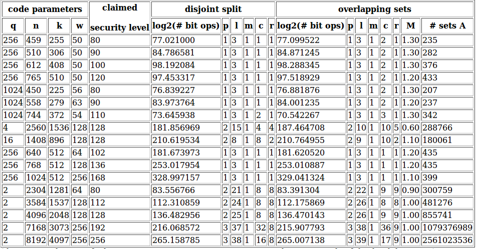

Check out my pages on Github: [https://github.com/christianepeters](https://github.com/christianepeters)

### Selected repositories:

- [homomorphic-encryption](https://github.com/christianepeters/homomorphic-encryption) - how to install **helib**, **SEAL**, **fhe-toolkit-linux**, etc
- [howto](https://github.com/christianepeters/howto) - collection of scripts and configuration guidelines (from Docker to Belgian eiD card)
- [coronalert](https://github.com/christianepeters/coronalert) - Python script to validate test codes for the Belgian privacy-friendly Corona alert app
- [phdthesis](https://github.com/christianepeters/phdthesis)
- [bibtex](https://github.com/christianepeters/bibtex)
- [wild](https://github.com/christianepeters/wild) - decoder for alternant codes ("wild Goppa codes")
- [isdf2](https://github.com/christianepeters/isdf2) - information-set decoding for binary codes
- [isdfq](https://github.com/christianepeters/isdfq) - information-set decoding for q-ary codes
- [2reg](https://github.com/christianepeters/2reg) - information-set decoding for code-based hash functions

* * *

### Archive:

Here you find some old material related to research I did a couple of years ago. The content is no longer maintained.

1. [Iteration and operation count for information-set decoding over Fq](#isdfq)
2. [Wild-Goppa-code decoder](#wild)
3. [Complexity approximation 2-regular syndrome decoding](#2reg)

#### 1\. Iteration and operation count for information-set decoding over Fq

My paper [Information-set decoding for linear codes over Fq](http://eprint.iacr.org/2009/589/) presents a new algorithm for decoding linear codes over arbitrary finite fields Fq.

##### Crude approximation (Pari script)

If the field size q is large then the cost of the first step (updating the matrix) becomes negligible since the cost of the algorithm is dominated by the search for 2p columns adding up to 0 on l positions. One can afford to choose k columns uniformly at random at the beginning of each iteration and then perform a full Gaussian elimination with respect to those k columns. In order to get a good estimate for the running time you can use the PARI/GP script [isdfq.gp](https://github.com/christianepeters/isdfq/blob/master/isdfq.gp) to estimate the cost of information-set decoding (ISD). If you care only about q=2 have a look at [isdf2.gp](https://github.com/christianepeters/isdf2/blob/master/isdf2.gp).

Note that this rather crude approximation gives a running time which is worse by a factor of 2 or more than the Markov-chain analysis below. It's fine if you just want to know in which ballpark your parameters are.

If q is small (q=2, q=3, maybe some cases where q=4) it makes sense to speed up the first step (definitely for q=2, see [our PQCrypto'08 paper](http://eprint.iacr.org/2008/318/)).

##### Markov-chain computation (using MPFI lib)

The ISD algorithm is probabilistic in that it makes random choices. To compute the average number of iterations it is necessary to analyze a Markov chain. For each choice of parameters of the decoding algorithm the following C program computes the expected number of iterations as well as the number of bit operations needed.

If this approach is used to estimate the security of a code-based cryptosystem against information-set-decoding attacks, the user must run the program repeatedly to search a range of parameter choices for the decoding algorithm. For example, trying this program with a wide range of algorithm parameters for decoding 48 errors in a \[961,771\] code over F31 identifies the parameters p=2, l=7, c=12, and r=1 as optimal and shows that 2128 bit operations are used by the information-set-decoding attack, as reported in the paper.

In fact, it was used to search a range of attack parameters against a range of codes over F31 to identify this code with \[961,771,>=96\] as having minimal keysize k x (n-k) among all codes over F31 that require at least 2128 steps in the decoding algorithm.

See below for an explanation of how to use the _isdfq.c_ program and several examples.

Download from my [GitHub](https://github.com/christianepeters/isdfq) repos: [isdfq.c](https://github.com/christianepeters/isdfq/blob/master/isdfq.c)

- The _isdfq.c_ program uses the [MPFI library](http://perso.ens-lyon.fr/nathalie.revol/software.html) which is built on top of the [MPFR library](http://www.mpfr.org/), which is built on top of the [GMP library](http://gmplib.org/).
- This program works for any field Fq, including the binary case. This program supersedes the program given for binary codes whose record can be found in the repository [https://github.com/christianepeters/isdf2/](https://github.com/christianepeters/isdf2/).
- The _isdfq.c_ program takes the following 13 inputs:
    - field size q (default 31)
    - code length n (default 961);
    - code dimension k (default 771);
    - number of errors w (default 48);
    - algorithm parameter p (default 2);
    - algorithm parameter l (default 20);
    - algorithm parameter m (default 1);   [(\*)](#m)
    - algorithm parameter c (default 7);
    - algorithm parameter r (default 1);
    - use overlapping sets by setting fs=1; (default 0);
    - algorithm parameter M for the fs=1 case (adjust number of subsets by multiplying the standard choice binomial(k,p)/sqrt(binomial(2p,p)) by a factor of M) (default 1.);
    - look for a weight-w word by setting mww=1; (default 0);
    - adjust precision by setting prec (default 300).
- The user can confirm a choice of parameters for the algorithm using this program. The program does not choose the best algorithm parameters itself. The user should loop over all suitable choices for p,l,m,c,r, and M in order to figure out the lowest cost for an attack.
- Examples:
    - Compile using gcc -o isdfq isdfq.c -lm -lgmp -lmpfr -lmpfi
    - Run ./isdfq to get the number of operations for decoding 48 errors in a \[961,771\] code over F31 with parameters p=2, l=7, c=12, r=1. q=31 n=961 k=771 w=48 p=2 l=7 m=1 c=12 r=1: bit ops 129.023892, bit ops per it 32.208747, log2 #it 96.815146
    - Run ./isdfq 4 2560 1536 128 2 15 1 8 4 0 1 0 400 to get the number of operations it takes to find a weight-128 word in a \[2560,1536\] code over F4 when using parameters p=2, l=15, m=1, c=8, and r=4. q=4 n=2560 k=1536 w=128 p=2 l=15 m=1 c=8 r=4: bit ops 181.857556, bit ops per it 27.515332, log2 #it 154.342224
    - Run ./isdfq 2 1024 524 50 2 20 2 7 7 to get the numbers of operations to decode 50 errors in a \[1024,524\] binary code using parameters p=2, l=20, m=2, c=7, r=7. q=2 n=1024 k=524 w=50 p=2 l=20 m=2 c=7 r=7: bit ops 60.179978, bit ops per it 21.864968, log2 #it 38.315010
    - Run ./isdfq 2 1024 525 50 2 20 2 7 7 0 1. 1 to get the number of operations it takes to find a weight-50 word in a \[1024,525\] binary code using the algorithm with parameters p=2, l=20, m=2, c=7, r=7 (note that the value of mww is set to 1). q=2 n=1024 k=525 w=50 p=2 l=20 m=2 c=7 r=7: bit ops 60.392514, bit ops per it 21.944141, log2 #it 38.448373
- Cost of attacking codes proposed by
    
    - Thierry Berger, Pierre-Louis Cayrel, Philippe Gaborit, Ayoub Otmani. _Reducing key length of the McEliece cryptosystem_. Africacrypt 2009. [http://users.info.unicaen.fr/~otmani/pdf/africacrypt09.pdf](http://users.info.unicaen.fr/~otmani/pdf/africacrypt09.pdf)
    - Rafael Misoczki, Paulo S. L. M. Barreto. _Compact McEliece keys from Goppa codes_. SAC 2009. [http://eprint.iacr.org/2009/187](http://eprint.iacr.org/2009/187)
    
    
    
    The commands to verify these parameters are: ./isdfq 256 459 255 50 1 3 1 1 1 0 1.00 0 300 ./isdfq 256 459 255 50 1 3 1 2 1 1 1.30 0 300 ./isdfq 256 510 306 50 1 3 1 1 1 0 1.00 0 300 ./isdfq 256 510 306 50 1 3 1 2 1 1 1.30 0 300 ./isdfq 256 612 408 50 1 3 1 1 1 0 1.00 0 300 ./isdfq 256 612 408 50 1 3 1 2 1 1 1.30 0 300 ./isdfq 256 765 510 50 1 3 1 1 1 0 1.00 0 300 ./isdfq 256 765 510 50 1 3 1 2 1 1 1.20 0 300 ./isdfq 1024 450 225 56 1 3 1 1 1 0 1.00 0 300 ./isdfq 1024 450 225 56 1 3 1 2 1 1 1.30 0 300 ./isdfq 1024 558 279 63 1 3 1 1 1 0 1.00 0 300 ./isdfq 1024 558 279 63 1 3 1 2 1 1 1.20 0 300 ./isdfq 1024 744 372 54 1 3 1 2 1 0 1.00 0 300 ./isdfq 1024 744 372 51 1 3 1 3 1 1 1.30 0 300 ./isdfq 4 2560 1536 128 2 15 1 4 4 0 1.00 0 400 ./isdfq 4 2560 1536 128 2 10 1 10 5 1 0.60 0 400 ./isdfq 16 1408 896 128 2 8 1 8 2 0 1.00 0 400 ./isdfq 16 1408 896 128 2 9 1 10 2 1 1.10 0 400 ./isdfq 256 640 512 64 1 3 1 1 1 0 1.00 0 300 ./isdfq 256 640 512 64 1 3 1 1 1 1 1.20 0 300 ./isdfq 256 768 512 128 1 3 1 1 1 0 1.00 0 500 ./isdfq 256 768 512 128 1 3 1 1 1 1 1.20 0 500 ./isdfq 256 1024 512 256 1 3 1 1 1 0 1.00 0 750 ./isdfq 256 1024 512 256 1 3 1 1 1 1 1.10 0 750 ./isdfq 2 2304 1281 64 2 21 1 8 8 0 1.00 0 300 ./isdfq 2 2304 1280 64 2 22 1 9 9 1 0.90 0 300 ./isdfq 2 3584 1537 128 2 24 1 8 8 0 1.00 0 300 ./isdfq 2 3584 1536 128 2 26 1 8 8 1 1.00 0 350 ./isdfq 2 4096 2048 128 2 25 1 8 8 0 1.00 0 400 ./isdfq 2 4096 2048 128 2 26 1 9 9 1 1.00 0 400 ./isdfq 2 7168 3073 256 3 37 1 32 8 0 1.00 0 600 ./isdfq 2 7168 3072 256 3 38 1 36 9 1 1.00 0 700 ./isdfq 2 8192 4097 256 3 38 1 16 8 0 1.00 0 700 ./isdfq 2 8192 4096 256 3 39 1 17 9 1 1.00 0 700

(\*) The algorithm looks for words having weight p among the positions indexed by a set X, weight p among the positions indexed by a set Y and weight 0 among l positions indexed by a set Z. In the paper [Attacking and defending the McEliece cryptosystem](http://eprint.iacr.org/2008/318/) Dan Bernstein, Tanja Lange, and I proposed to speed up Stern's algorithm for codes over F2 by taking m sets Z1,...,Zm outside the information set, each with l positions and to look for words having weight p among the X-indexed positions, weight p among the Y-indexed positions, and weight 0 among the positions indexed by one of those sets Zj. For small q, such as q=2, it turns out that using m>1 provides better results. For codes over arbitrary fields Fq I considered only one set Z. That's why the default setting of _isdfq.c_ is m=1.

#### 2\. Wild-Goppa-code decoder

Here we make a simple Python script available which demonstrates how to decode wild Goppa codes. The algorithm is described in detail in the article [Wild McEliece](http://eprint.iacr.org/2010/410) by [Daniel J. Bernstein](http://cr.yp.to/djb.html), [Tanja Lange](http://www.hyperelliptic.org/tanja/), and myself.

Download [wild-decoder.py](https://github.com/christianepeters/wild/blob/master/wild-decoder.py)

#### 3\. Complexity approximation 2-regular syndrome decoding

The paper [Faster 2-regular information-set decoding](https://eprint.iacr.org/2011/120/) presents an algorithm to speed up information-set decoding attacks on fast-syndrome based hash functions.

Here's a script in pari that approximates the computations in the paper. The count is not entirely accurate (writing it on request by a student in May 2018) but it gives you the right ball park:

Download [2reg.gp](https://github.com/christianepeters/2reg/blob/master/2reg.gp)
